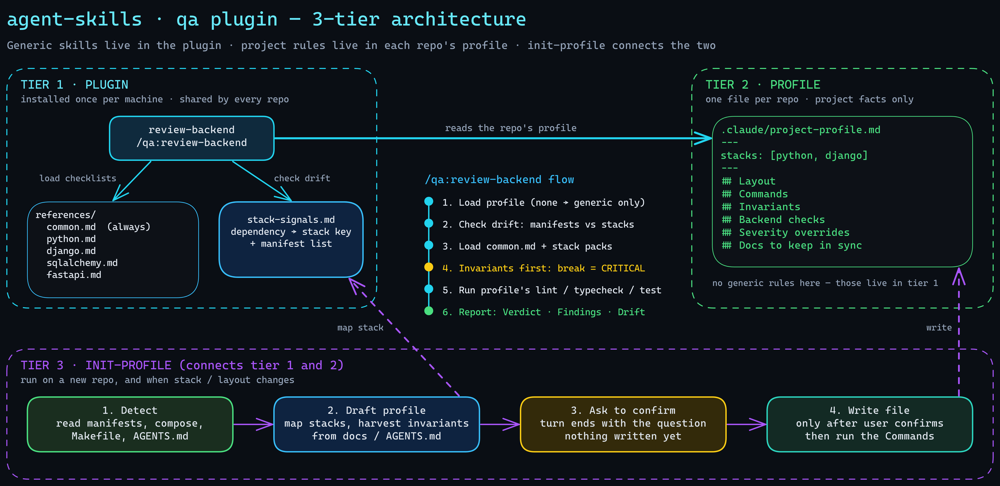

# agent-skills

Personal engineering skills for [Claude Code](https://code.claude.com), distributed as a plugin marketplace.

The skills are generic: workflow, severity model, checklists per layer and stack. Everything specific to a project lives in that project's `.claude/project-profile.md`, so no skill is copied into project repos and nothing drifts between them.



1. **Plugin (this repo):** review, performance, and finish workflows, severity model, layer checklists, stack packs, `stack-signals.md`, and a script that computes drift.
2. **Profile (each project repo):** `.claude/project-profile.md` with layout, commands, invariants, critical areas, project-specific checks.
3. **`/qa:init-profile`:** detects the stack, asks you to confirm the layout, drafts the profile, asks before writing it.

Editable source of the diagram: [`docs/architecture.excalidraw`](docs/architecture.excalidraw).

## Plugins

| Plugin | Skills |
|---|---|
| `qa` | `/qa:review`, `/qa:finish`, `/qa:perf`, `/qa:init-profile` |

Layers: `backend`, `frontend`, `infra`, `docs`. Stack packs: `python`, `django`, `sqlalchemy`, `fastapi`, `pyqt`, `vue`, `inertia`, `astro`, `tailwind`, `docker`, `caddy`, `mkdocs`. Desktop Qt UIs (`pyqt`) are reviewed as `backend`.

## Install

Just for yourself (all projects on this machine):

```bash
claude plugin marketplace add dqcuong93/agent-skills
claude plugin install qa@dqcuong93
```

For everyone working in a repo, commit this to the repo's `.claude/settings.json` and pin a tag:

```json
{
  "extraKnownMarketplaces": {
    "dqcuong93": {
      "source": { "source": "github", "repo": "dqcuong93/agent-skills", "ref": "v0.5.0" }
    }
  },
  "enabledPlugins": { "qa@dqcuong93": true }
}
```

Machines without a GitHub SSH key: set `CLAUDE_CODE_PLUGIN_PREFER_HTTPS=1`.

## Quick start

```
/qa:init-profile      # once per project: confirm the layout, draft and write the profile
/qa:review            # review what you changed
/qa:finish            # before you commit: review, verify, fix, test gaps, docs, commit message
```

**Full guide: [`docs/USAGE.md`](docs/USAGE.md)** (commands and flags, how to read a report, the profile, keeping a project current, headless use, troubleshooting).

## Status

`v0.5.0`. (`v0.3.0` and `v0.3.1` were tagged on earlier commits that do not match their `plugin.json`; use `v0.5.0`.) `v0.5.0` adds a PyQt/PySide pack. One headless run on a planted-bug clone found 3 of 3. `v0.4.1` tightens the docs and frontend checks after a side-by-side run against three real changes: documented behaviour must be checked against the code, a changed contract is searched across all docs, and frontend gets unresolved-state, failed-check, expired-session, role-aware-copy, and stale-value checks. On those runs the review found the same important defects as the in-repo skills it replaces at about half the tokens, and fewer maintainability nits. Every skill was tested by running it headless against real or cloned projects with planted bugs and comparing with the in-repo skill it replaces, with Claude Sonnet and one to a few runs per case, so treat the results as indicative, not as rates. The record is [`docs/acceptance.md`](docs/acceptance.md).

Known gaps:

- Packs for `nuxt` and `k8s` are not written.
- `/qa:review all` is tested on one backend (one orchestrator run found 7 of 7 planted bugs; it costs several times a diff review). Frontend, infra, and docs in `all` mode are untested.
- The `Packs:` line says which packs a review should load, not that the model read them.
- `/qa:init-profile` write on an update worked once with `bypassPermissions` (`.claude/` is protected under `acceptEdits`). A first-run write from scratch is untested.
- The banned-word scan in `scripts/check-plugin.py` only runs where a local `.banned-words` exists, so not in CI.
- Cursor does not read Claude plugins; `npx skills add dqcuong93/agent-skills -a cursor` is an untested option.

## Rules for this repo

- A rule true for every project on a layer goes in `references/<layer>.md`; true for one stack goes in `references/<layer>-<stack>.md` (starting with `Written for: <stack> <major>`); true for one project goes in that project's profile, never here.
- No project names, client names, domains, hosts, credentials, or business rules in this repo. It is public.
- Plugin names must not start with `claude-`, `anthropic-`, or `cc-plugin-`.

## Develop

```bash
claude plugin validate . --strict
claude plugin validate ./plugins/qa --strict
python3 scripts/check-plugin.py                         # structure + optional local .banned-words scan
python3 -m unittest discover -s scripts -p 'test_*.py'  # tests of the drift script
claude --plugin-dir ./plugins/qa                        # load the working copy in a session
```

See [`CLAUDE.md`](CLAUDE.md) for how skills are tested and the gotchas found so far.

## License

MIT
